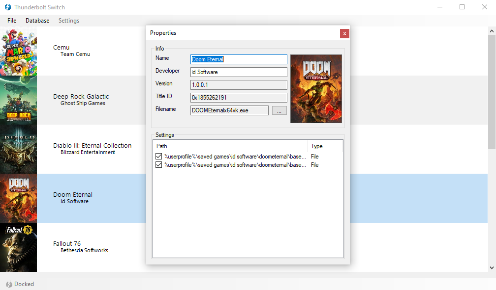

# Thunderbolt Switch

Thunderbolt Switch, a software that switches your game settings depending on whether you are connected to an external GPU or not.

## Project Status

Refer to https://github.com/Valkirie/Thunderbolt-Switch/wiki/Status for the updated project status.

## Guide

**Database**

The database stores every information related to your games or applications managed by Thunderbolt Switch. You can either add new applications to your database by Manually Selecting them or use the (Beta) Automatic Detection.

- Click on "Database".
- Click on "Select Manually" and pick the the game executable.
- Click on "Automatic Detection" and wait until Thunderbolt Switch asks you which software you'd like to add to the list.

**Settings**

Settings menu has not yet been implemented. All your Thunderbolt Switch settings are stored inside "DockerForm.exe.config".
From there you can change a few settings:
- MinimizeOnStartup : If True, software will start minimized.
- MinimizeOnClosing : If True, software will get minimized instead of closing when using the top right cross.
- BootOnStartup : Not yet implemented. Use Windows Task Scheduler instead.
- ImageHeight / ImageWidth : Defines the size of executable image inside the application list.
- MonitorProcesses : If True, software will detect database application start/stop and manage bounds power profile and settings.
- IGDBListLength : Defines the number of returned application details suggestions when using "Download from IGDB" from the Game Properties window.
-ToastNotifications : If True, windows will display notifications on specific software events.
- SaveOnExit : If True, software will force save all your current settings on software exit.

**Properties**

The Game Properties window will be displayed and will try to collect as much information as possible from your executable, including: Game Name, Game Developer, Game Version and Game Visual. To link your application to IGDB and automatically gather details from there database, right click on the Game Visual and select "Download from IGDB". The IGDB search will be based on the "Name" settings field.

- Right clicking on the Settings tab will allow you to link Settings File or Registry to your application. To do so, click on "Create Setting" then select the setting type from the list: File or Registry depending on where your application settings are stored. (*If you need help locating your application settings location, right click on the Application Visual and select "Search on PCGaming Wiki"*).

**Application List**

The Game List will display all your currently handled applications. From that list, you can right click on any title to display the Action Menu.
From where you can quickly:
- Start the Game
- Open the Game Location
- Open each Settings Location
- Remove the Game from the Database
- Open the Game Properties window

**Power Profile**

Power Profiles contains configurable Power Information and are stored are xml files inside the /profiles/ folder. Power Profiles can be triggered through User-defined Triggers or be bounds to a specific Game to finely adapt your device power, CPU and GPU capacities based on your usage scenario. (*Use the default.xml template to create as many Power Profiles as you want*).

Power Information:
- Turbo Boost Long Power Max
- Turbo Boost Short Power Max
- Adaptive Voltage (CPU Core, CPU Cache, System Agent, Intel GPU)
- Intel Power Balance

User-defined Triggers (*ApplyMask value. Can be added together. ApplyMask 3 would trigger the Power Profile on both Battery/Plugged In Power Status*).
- When device power status has changed (*1: On Battery, 2: Plugged In*)
- When device docking status has changed (*4: External GPU Detected*)
